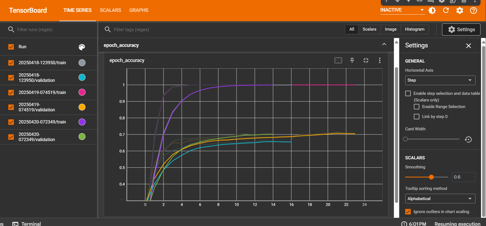
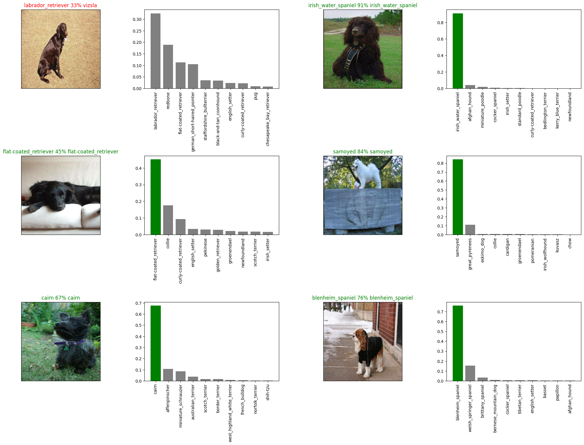

# Dog-Breed-Classifier
Dog breed classification using deep learning (TensorFlow &amp; TF Hub)
Here’s a clean and professional `README.md` for your **Dog Vision** project on GitHub:

---

## 🐶 Dog Vision: Dog Breed Classification with Deep Learning

This project builds an **end-to-end deep learning model** to classify over **120 different dog breeds** from images using **TensorFlow 2.x** and **TensorFlow Hub**. It was inspired by the [Kaggle Dog Breed Identification Challenge](https://www.kaggle.com/c/dog-breed-identification).

---

### 📌 Problem Statement

> Given an image of a dog, identify its breed from 120 possible classes using a deep learning model.

---

### 🔍 Dataset

The dataset is sourced from Kaggle's Dog Breed Identification competition:

* Over **10,000+ labeled images**
* 120 unique dog breeds
* Training and test image sets

[🔗 Dataset Link](https://www.kaggle.com/c/dog-breed-identification/data)

---

### 🧠 Project Highlights

* 📊 **Exploratory Data Analysis** (EDA) on breed distributions
* 🖼️ Image preprocessing and tensor conversion
* 🔁 **Transfer Learning** using pretrained models from TensorFlow Hub
* 🏋️‍♂️ Model training and validation
* 🔮 Predictions with breed confidence scores
* 📈 Visualizations of training progress and predictions

---

### 🛠️ Tools & Technologies

* TensorFlow 2.x
* TensorFlow Hub
* Pandas, Matplotlib
* Google Colab (for GPU acceleration)

---

### 🧪 How to Run

1. Clone the repository:

   ```bash
   git clone https://github.com/your-username/dog-vision.git
   cd dog-vision
   ```

2. Install dependencies:

   ```bash
   pip install -r requirements.txt
   ```

3. Open the Jupyter Notebook:

   ```bash
   jupyter notebook Dog_Vision.ipynb
   ```

---

### 📷 Sample Output


---



---

### 📚 Learning Outcomes

* Hands-on experience with image data pipelines
* Mastery of TensorFlow Hub and transfer learning workflows
* Better understanding of multi-class classification with deep learning

---

### 🤝 Let's Connect

If you're working on similar deep learning or computer vision projects, feel free to reach out or collaborate!

---

